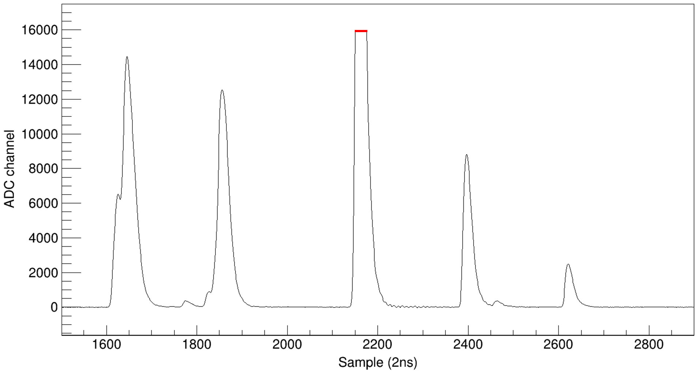

# Pile-up recovery algorithm

Based on CERN ROOT v6.20.06

## Original waveform

Assume the baseline has been corrected to zero.

For LaBr3 waveform under 500MHz sampling rate, the range of influence of a single pulse is 100 samples before and after the peak.

Meanwhile, the range from 20 samples to the left of the peak to 80 samples to the right of the peak is considered as effective. The amplitude can be neglected outside this range for a single pulse.

```cpp
std::vector<int> wave;        // original waveform
int npnt = wave.size();
const int length = 100;         // range of influence
const int rangeleft = -20;      // effective wave range left
const int rangeright = 80;      // effective wave range right
const int noise = 20;           // maximum amplitude of noise
```


------

## Obtain fastfilter signals

For LaBr3 waveform under 500MHz sampling rate, the parameter L for fastfilter is set to 5.

```cpp
const int L = 5;   // fastfilter parameter
std::vector<int> fastfilter;
for (int ipnt = 0; ipnt < npnt; ipnt++){
    int ff = 0;   // fastfilter value
    if ( ipnt >= L && ipnt <= npnt-L ){
        for (int jpnt = 0; jpnt < L; jpnt++)
            ff += wave[ipnt+jpnt] - wave[ipnt-L+jpnt];
        ff /= L;
    }
    
    fastfilter.push_back(ff);
}
```


## Find trigger points

To avoid false triggers, two fastfilter points before the trigger point are requested to be lower than the threshold.

```cpp
std::vector<int> trigger;
for (int ipnt = 2; ipnt < npnt; ipnt++){
    if ( fastfilter[ipnt] >= thres && fastfilter[ipnt-1] < thres && fastfilter[ipnt-2] < thres )
        trigger.push_back(ipnt);
}
int ntrigger = trigger.size();  // total number of triggers
```


----

## Plot FWHM vs. Amplitude 2-D histogram

The following codes show the processing of a single waveform. In practice, all the waveform are processed and filled into the 2-D figures.

Triggers situated out of the range of influence of their neighbours are selected.

```cpp
TH2D *h2fwhm;  // FWHM vs. Amplitude 2-D histogram, to be initialized

for (int itrig = 0; itrig < ntrigger; itrig++){
                
    // discard pile-up triggers
    if ( itrig > 0 && trigger[itrig] - trigger[itrig-1] < length ) continue;
    if ( itrig < ntrigger-1 && trigger[itrig+1] - trigger[itrig] < length ) continue;
                
    // find peak position and height corresponding to the trigger
    int xmax = -1;
    double ymax = -1;
    for (int ipnt = trigger[itrig]; ipnt < npnt; ipnt++){
        if ( wave[ipnt] > ymax ){
            ymax = wave[ipnt];
            xmax = ipnt;
        }
        else if (ipnt - xmax > 5) break;
    }
                
    // discard incomplete pulse shapes at the edge of the waveform
    if ( xmax < length || xmax > npnt - length ) continue;

    // calculate FWHM
    double left = -1000, right = -1000;    // points crossing half maximum
    for (int ipnt = trigger[itrig]; ipnt < npnt; ipnt++){
        if ( wave[ipnt] <= ymax/2 && wave[ipnt+1] > ymax/2 )
            left = ((wave[ipnt+1]-ymax/2)*ipnt-(wave[ipnt]-ymax/2)*(ipnt+1))/(wave[ipnt+1]-wave[ipnt]);
        if ( wave[ipnt] >= ymax/2 && wave[ipnt+1] < ymax/2 )
            right = ((wave[ipnt+1]-ymax/2)*ipnt-(wave[ipnt]-ymax/2)*(ipnt+1))/(wave[ipnt+1]-wave[ipnt]);
        if ( left > 0 && right > 0 ) break;
    }
    double FWHM = right - left;

    // plot 2-D histogram
    h2fwhm->Fill(ymax, FWHM);
}
```

## Get TCutG

Use graphical cut in ROOT to select non-pile-up pulses from h2fwhm 2-D histogram, and save as ROOT script.

Then, read the script and get the TCutG as an object into the memory.

```cpp
TCutG cutg;  // graphical cut, to be initialized
```


----

## Plot PointHeight vs. Amplitude scatter diagram and fit by quadratic polymonial

The following codes show the processing of a single waveform. In practice, all the waveform are processed and filled into the scatter diagram.

Amplitude correlation of points in the range of influence are fitted.

```cpp
const int nfitpnt = 2*length;
TGraph *grpnt[nfitpnt];      // PointHeight vs. Amplitude scatter diagram, to be initialized

for (int itrig = 0; itrig < ntrigger; itrig++){
                
    // discard pile-up triggers
    if ( itrig > 0 && trigger[itrig] - trigger[itrig-1] < length ) continue;
    if ( itrig < ntrigger-1 && trigger[itrig+1] - trigger[itrig] < length ) continue;
                
    // find peak position and height corresponding to the trigger
    int xmax = -1;
    double ymax = -1;
    for (int ipnt = trigger[itrig]; ipnt < npnt; ipnt++){
        if ( wave[ipnt] > ymax ){
            ymax = wave[ipnt];
            xmax = ipnt;
        }
        else if (ipnt - xmax > 5) break;
    }
                
    // discard incomplete pulse shapes at the edge of the waveform
    if ( xmax < length || xmax > npnt - length ) continue;

    // calculate FWHM
    double left = -1000, right = -1000;    // points crossing half maximum
    for (int ipnt = trigger[itrig]; ipnt < npnt; ipnt++){
        if ( wave[ipnt] <= ymax/2 && wave[ipnt+1] > ymax/2 )
            left = ((wave[ipnt+1]-ymax/2)*ipnt-(wave[ipnt]-ymax/2)*(ipnt+1))/(wave[ipnt+1]-wave[ipnt]);
        if ( wave[ipnt] >= ymax/2 && wave[ipnt+1] < ymax/2 )
            right = ((wave[ipnt+1]-ymax/2)*ipnt-(wave[ipnt]-ymax/2)*(ipnt+1))/(wave[ipnt+1]-wave[ipnt]);
        if ( left > 0 && right > 0 ) break;
    }
    double FWHM = right - left;
    
    // eliminate peak pile-up pulses
    if ( cutg->IsInside(ymax, FWHM) ) continue;

    // plot 2-D figure
    for (int ipnt = 0; ipnt < nfitpnt; ipnt++)
        grpnt[ipnt]->SetPoint(grpnt[ipnt]->GetN(), ymax, wave[xmax+ipnt-length] / ymax);
}
```

```cpp
TF1 *fpnt[nfitpnt];
for (int ifitpnt = 0; ifitpnt < nfitpnt; ifitpnt++){
    fpnt[ifitpnt] = new TF1("fpnt", "[0]+[1]*x+[2]*x*x", 0, 20000);  // fitting function: quadratic polymonial
    grpnt[ifitpnt]->Fit(fpntpol2[ifitpnt], "ROB");     // robust fit
}
```


------

## Get Integral vs. Amplitude relationship

For scintillator detectors, the deposited energy is proportional to the integral of the pulse.

```cpp
TF1 *fe = new TF1("fe", "x*([0]+[1]*x+[2]*x*x)", 0, 20000);  // Integral vs. Amplitude correlation
for (int ifitpnt = 0; ifitpnt < nfitpnt; ifitpnt++){
    if ( ifitpnt - length < rangeleft || ifitpnt - length > rangeright ) continue; // only integrate inside the effective range
    fe->SetParameter(0, fe->GetParameter(0) + fpnt[ifitpnt]->GetParameter(0));
    fe->SetParameter(1, fe->GetParameter(1) + fpnt[ifitpnt]->GetParameter(1));
    fe->SetParameter(2, fe->GetParameter(2) + fpnt[ifitpnt]->GetParameter(2));
}
```

## Find saturated signals

Saturated sections will be rejected during fitting, which is identified by consecutive identical amplitudes.

```cpp
double rejval= -10000;       // saturated amplitude value
std::vector<int> vrejpnts;   // saturated sample points

for (int ipnt = 1; ipnt < gwave->GetN()-1; ipnt++)
    if ( wave[ipnt] == wave[ipnt-1] && wave[ipnt] == wave[ipnt+1] ){       // 3 identical amplitudes in a row
        rejval = wave[ipnt];
        break;
    }

for ( int ipnt = 0; ipnt < npnt; ipnt++ )
    if ( wave[ipnt] == rejval )
        vrejpnts.push_back(ipnt);
```        



----

## Fit function

```cpp
double fwave(double *val, double *par) // val: independent variable of the function; par: the parameters
{
    double x0 = val[0];    // point in the waveform
    
    // reject saturated sections
    for ( int rejpnt : vrejpnts )
        if ( abs(x0 - rejpnt) < 1 ){
            TF1::RejectPoint();
            return rejval;
       }
    
    double amplitude = 0;
    int npeaks = par[0];      // number of peaks
    for (int ipeak = 0; ipeak < npeaks; ipeak++){
        double A = par[2*ipeak+1];    // amplitude of the peak
        double pos = par[2*ipeak+2];  // position of the peak

        double x = x0 - pos;
        if ( x >= rangeleft && x <= rangeright ){   // only consider effective range
            int x1 = int(x + length);
            int x2 = x1 + 1;
            double y1 = fpnt[x1]->Eval(A);
            double y2 = fpnt[x2]->Eval(A);
            double y0 = y1 + (y1-y2) * ((x+length)-x1) / (x1-x2);  // interpolate between x1 and x2

            amplitude += A * y0;
        }
        else
            amplitude += 0;
    }
    return amplitude;
}
```


## Fit

The longer the fitting section, the lower the demand for optimizing chi2/ndf by adding a new peak. We thus take the lower limit of the ratio between the chi2/ndf values of the latter and the former fitting as

$$
\eta=1-(1-\eta_0)\cfrac{L_0}{L}
$$

where $L_0=\rm{rangeright}-rangeleft=100$ the shortest fitting range, $L=\rm{right}-left>100$ the actual fitting range, and

$$
\eta_0=0.7
$$


```cpp
const int peak2trig = 10;  // the approximate distance from a peak to its fastfilter trigger
const double eta0 = 0.7;

int npeaks0;
for (int itrig = 0; itrig < int(vtrig.size()); itrig += npeaks0){
                
    // get number of pile-up triggers
    npeaks0 = 1;
    for (int jtrig = itrig+1; jtrig < int(vtrig.size()); jtrig++){
        if ( vtrig[jtrig] - vtrig[jtrig-1] <= length ) npeaks0++;
        else break;
    }

    // fit range
    int left = std::max( 0, vtrig[itrig+0] + rangeleft );
    int right = std::min( vtrig[itrig+npeaks0-1] + rangeright, npnt );
                
    // find peak positions as the initial value of first fitting
    std::vector<double> vx, vy;
    for (int jtrig = itrig; jtrig < itrig+npeaks0; jtrig++)
        vx.push_back( vtrig[jtrig] + peak2trig );  // approximate position of peak
    int npeaks = vx.size();
        
    double chi2ndf0 = -1, chi2ndf1 = -1;
    TFitResultPtr fr;
    std::multimap<double, double> me;
                
    // first fitting according to triggering
    TF1 *f = new TF1("fwave", fwave, left, right, 2*npeaks0+1);   // use of fit function
    f->FixParameter(0, npeaks);
    for (int ipeak = 0; ipeak < npeaks; ipeak++){
        f->SetParameter(2*ipeak+1, std::max(wave[vx[ipeak]], 1.));
        f->SetParLimits(2*ipeak+1, 0, 100000);
        f->SetParameter(2*ipeak+2, vx[ipeak]);
        f->SetParLimits(2*ipeak+2, left - rangeright, right - rangeleft);
    }
    fr = gwave->Fit(f, "SQRN");
    chi2ndf0 = fr->Chi2() / fr->Ndf();

    // record results of first fitting
    for (int ipeak = 0; ipeak < npeaks; ipeak++){
        vy.push_back(f->GetParameter(2*ipeak+1));
        vx[ipeak] = f->GetParameter(2*ipeak+2);
    }

    do {
        npeaks = vx.size();
                    
        // search residual peaks
        TH1I* hres = new TH1I("", "", right-left, left, right);   // residual histogram
        for (int ipnt = left; ipnt < right; ipnt++)
            hres->SetBinContent(ipnt-left, abs( wave[ipnt] - f->Eval(ipnt) ) );
        TSpectrum *s = new TSpectrum(500);
        int nfound = s->Search(hres, 2, "", 0.1);
        double *xpeaks = s->GetPositionX();
        double *ypeaks = s->GetPositionY();
                    
        me.clear();
        for (int j = 0; j < nfound; j++)
            if ( ypeaks[j] > noise )     // searched peaks should exceed maximum noise amplitude
                me.insert(std::make_pair(ypeaks[j], xpeaks[j]));
                    
        if ( me.empty() ) break;    // if residuals are all under noise level (no high peaks), finish fitting

        // add a new peak and fit
        bool addnewpeak = false;
        if (f) delete f;
        f = new TF1("fwave", fwave, left, right, 2*(npeaks+1)+1);
        f->FixParameter(0, npeaks+1);
        for (auto im = me.rbegin(); im != me.rend(); im++){
            for (int ipeak = 0; ipeak < npeaks; ipeak++){
                f->SetParameter(2*ipeak+1, std::max(vy[ipeak], 1.));
                f->SetParLimits(2*ipeak+1, 0, 100000);
                f->SetParameter(2*ipeak+2, vx[ipeak]);
                f->SetParLimits(2*ipeak+2, left - rangeright, right - rangeleft);
            }
            f->SetParameter(2*npeaks+1, im->first);
            f->SetParLimits(2*npeaks+1, 0, 100000);
            f->SetParameter(2*npeaks+2, im->second);
            f->SetParLimits(2*npeaks+2, left - rangeright, right - rangeleft);

            fr = gwave->Fit(f, "SQRN");
            chi2ndf1 = fr->Chi2() / fr->Ndf();

            // verify if the add-peak fitting can optimize chi2/ndf value well enough
            if ( chi2ndf1 < (1-(1-eta0)*(rangeright-rangeleft)/(right-left))*chi2ndf0 ){
                addnewpeak = true;
                break;
            }
        }
                    
        if ( addnewpeak ){
            for (int ipeak = 0; ipeak < npeaks; ipeak++){
                vx[ipeak] = f->GetParameter(2*ipeak+2);
                vy[ipeak] = f->GetParameter(2*ipeak+1);
            }
            vx.push_back(f->GetParameter(2*npeaks+2));
            vy.push_back(f->GetParameter(2*npeaks+1));
            chi2ndf0 = chi2ndf1;
        }
        else break;
                    
    } while (int(vx.size()) <= npeaks0 + 100);  // maximum number of pile-up pulses is 100

    // sort the fitted peaks by time
    std::multimap<double,int> mt;
    for (int ipeak = 0; ipeak < f->GetParameter(0); ipeak++)
        mt.insert(std::make_pair(f->GetParameter(2*ipeak+2), ipeak));
    
    // output results
    for (auto im = mt.begin(); im != mt.end(); im++){
        int ipeak = im->second;

        double e = fe->Eval(f->GetParameter(2*ipeak+1));  // to be calibrated
        double t = f->GetParameter(2*ipeak+2);   // in the unit of sample point
        int npileup = f->GetParameter(0);        // number of pile-up peaks that are fitted together
        double chi2ndf = chi2ndf0;               // chi2/ndf value
    }
}
```


